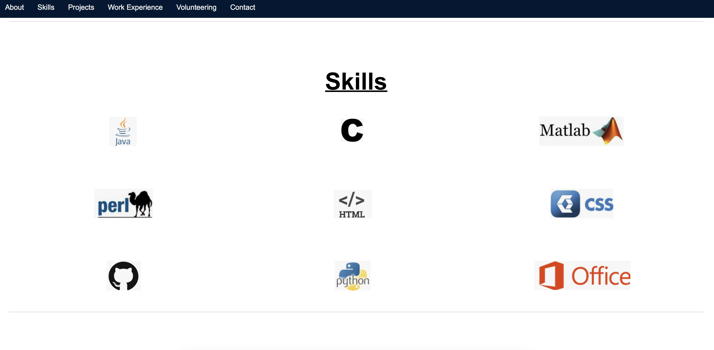
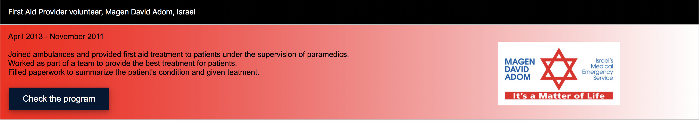

# My professional old website

The header has a slide show of three pictures and a title.

Scrolling down, there is a skills sections that show my knowledge base:

When keep scrolling down, there is the work section and the volunteering section: 

Pressing one of the work/ volunteer bars will open a text bar underneath with an explanation of that subject:

The page ends with a footer containing contact information:

In order to fascilitate the orientation in the side, I added a sticky navigation bar

